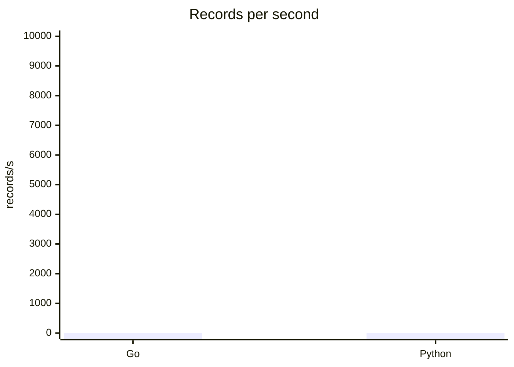

# Go vs Python collection report

The repository contains both collectors:

- Go: `cmd/collector`
- Python: `python/collector/async_collector.py`

Expected comparison dimensions:

| Collector | Transport | Records/s | RSS MB | CPU % |
| --- | --- | ---: | ---: | ---: |
| Go | in-process simulation + window aggregation | fill after run | fill after run | fill after run |
| Python | asyncio simulation benchmark | fill after run | fill after run | fill after run |

Chart placeholders:

The Python runtime is not available in the current workspace, so measured values should be filled on a machine with Python 3.12+ installed.
