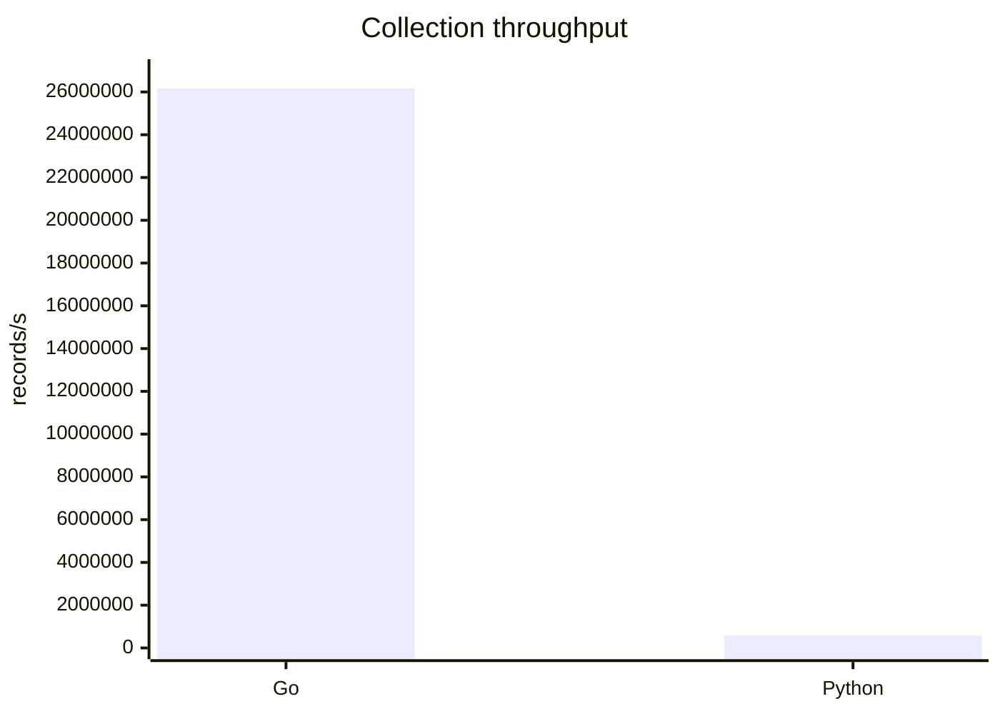
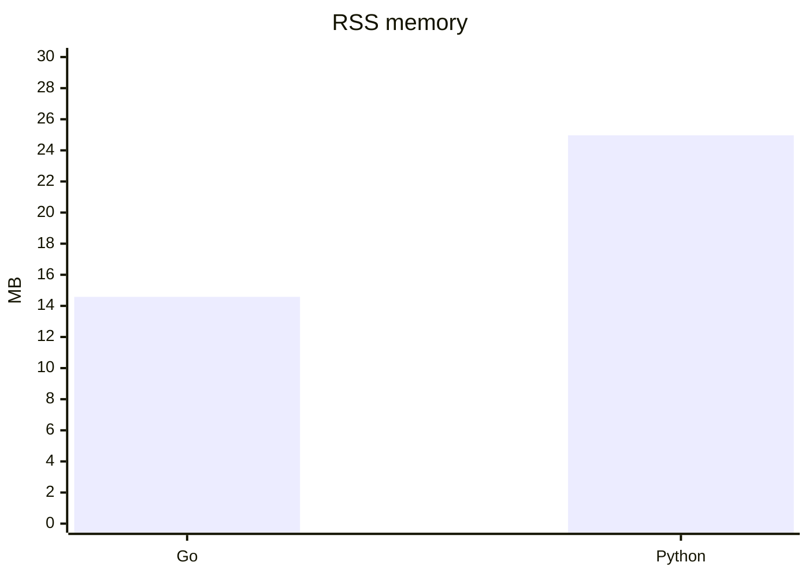

# Go vs Python collection report

## Methodology

Measurements were made on 2026-05-28 in the project workspace on Windows.

Scenario:

- duration: 10 seconds;
- workload: emulated health sensor readings;
- mode: maximum local collection throughput, no network I/O;
- validation: enabled for Go through `health.ValidateReading`;
- Python benchmark: `python/collector/async_collector.py --duration 10 --rate 0`;
- Go benchmark: `go run ./scripts/go_collect_benchmark.go -duration 10s -rate 0`.

This scenario compares raw collection and validation overhead. Kafka, Arrow and dashboard I/O are intentionally excluded from this particular benchmark so both implementations run the same CPU-bound workload.

## Results

| Collector | Command | Records/s | RSS MB | CPU % |
| --- | --- | ---: | ---: | ---: |
| Go | `go run ./scripts/go_collect_benchmark.go -duration 10s -rate 0` | 26,171,972.56 | 14.58 | 98.5 |
| Python | `uv run --with psutil python ./python/collector/async_collector.py --duration 10 --rate 0` | 588,000.00 | 24.97 | 98.7 |

CPU percent is per-process utilization on the one saturated logical core. For Go it was calculated from process CPU seconds captured by PowerShell during the benchmark run. For Python it was reported by `psutil.Process().cpu_percent()`.

## Throughput Chart

## Memory Chart

## Interpretation

Go processed approximately 44.5 times more emulated readings per second than the Python asyncio implementation in the CPU-bound dry-run. Go also used less resident memory in this benchmark. Both implementations saturated roughly one logical CPU core, so the main difference comes from per-record overhead in the language/runtime and validation loop.

For the full pipeline, Go remains the collection-side implementation, while Python is used where it is strongest in this lab: Arrow consumption, streaming analysis and visualization.
